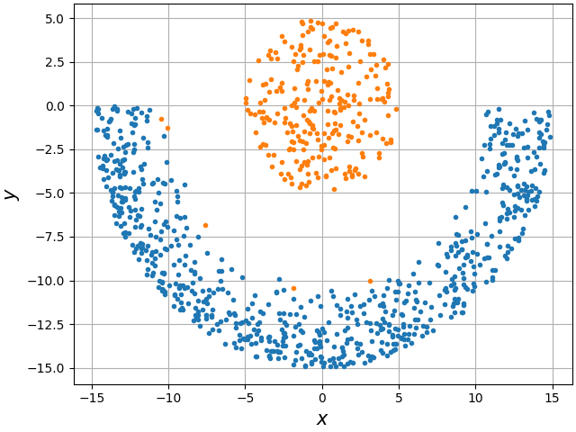
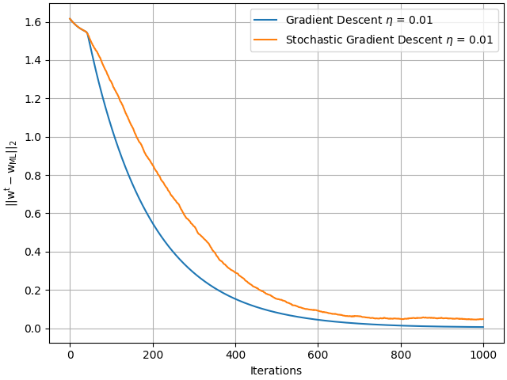
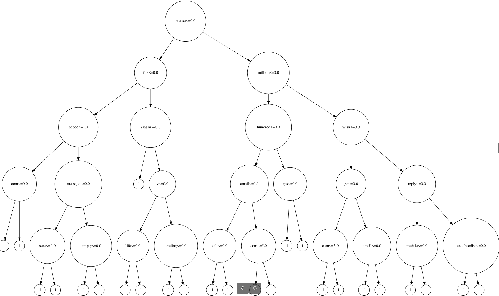
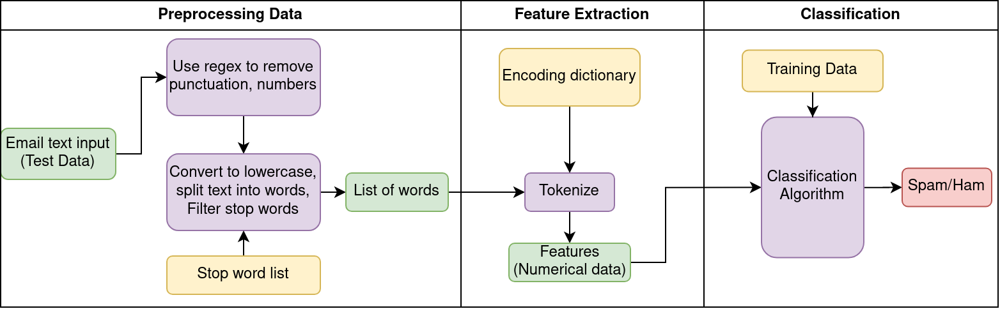

# Pattern Recognition and Machine Learning - Assignments

## File structure
```python
├── Assignment{x}
│   ├── data                    # To store given the datasets
│   ├── outputs                 # All the final plots, tables are saved here
│   ├── Report.pdf              # Detailed report 
│   └── scripts                 # Implementations for the models 
```

## Assignment 1 - PCA & Clustering
Models implemented:
+ K-Means 
+ Spectral Clustering
+ Principal component analysis (PCA)
+ Kernel PCA
### A few excerpts from the report
*(hover over the images for more infromation)*
<p float="left">
  
   
</p>


## Assignment 2 - Mixture models & Regression
Models implemented:
+ Mixture models (Bernoulli, Gaussian)
+ Linear regression
+ Ridge regression
### A few excerpts from the report
*(hover over the images for more infromation)*
<p float="left">
  
</p>

## Assignment 3 - Email spam classifier
Models implemented:
+ Naive Bayes model
+ Decision trees
+ AdaBoost
### A few excerpts from the report
*(hover over the images for more infromation)*
<p float="left">
  
  


</p>